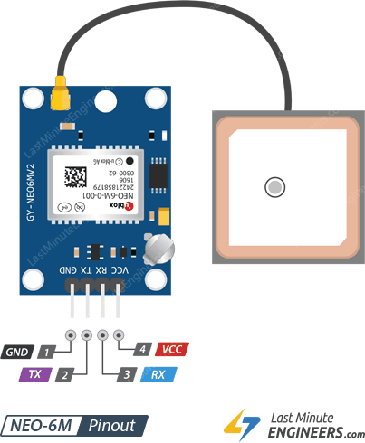
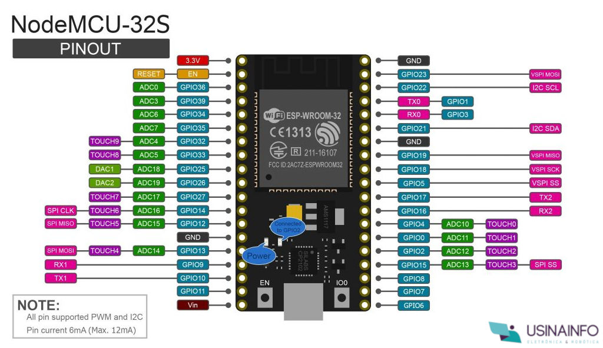
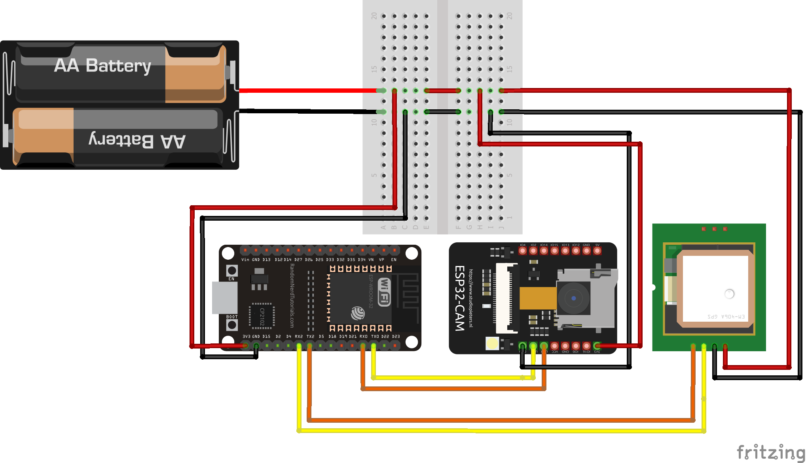
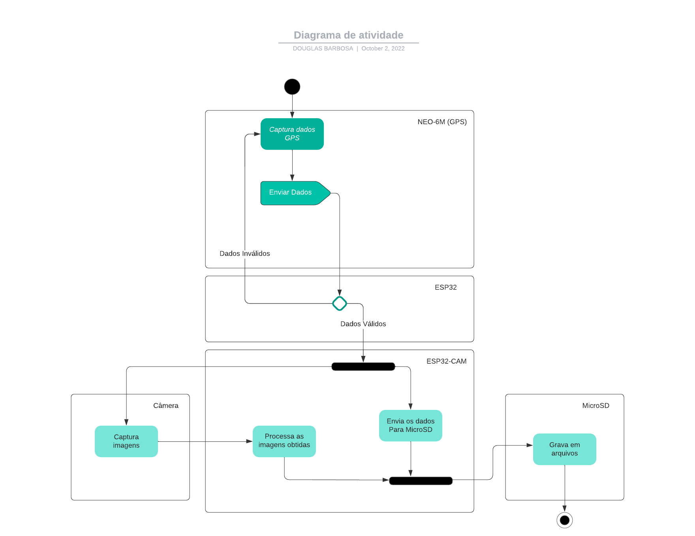
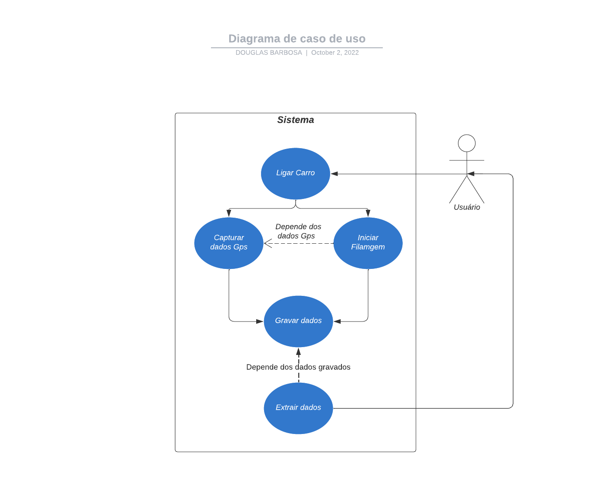

# CherryTracker

---

> ## 1 Introdução
>
> > #### 1.1 Obejtivo deste documento
> >
> > > &nbsp;&nbsp;&nbsp;&nbsp;&nbsp;&nbsp; Neste documento são apresentado a especificação e evidências de implementação de um protótipo que é responsável por capturar dados e armazená los, este protótipo foi nomeado de **CherryTracker**. Neste projeto temos o objetivo de aplicar os conceitos de FDD (Feature Driven Development) para o desenvolvimento do software, além de boas práticas de programação.
> >
> > #### 1.2 Escopo dos Hardwares do protótipo
> >
> > > #### 1.2.1 CherryTracker e seus principais componentes
> > >
> > > > - &nbsp;&nbsp;&nbsp;&nbsp;&nbsp;&nbsp; NEO-6M: Responsável por captar e processar os dados de GPS, esse hardware consegue se conectar com sinal GPS, por meio de sua antena e é facilmente configurável, um dos seus principais pontos negativos é a potência de sua antena que não é capaz de atuar em ambientes fechados (sem exposição ao céu).
> > > >   &nbsp;&nbsp;&nbsp;&nbsp;&nbsp;&nbsp; &nbsp;&nbsp;&nbsp;&nbsp;&nbsp;&nbsp; &nbsp;&nbsp;&nbsp;&nbsp;&nbsp;&nbsp;
> > > >
> > > > - &nbsp;&nbsp;&nbsp;&nbsp;&nbsp;&nbsp; ESP32: Este dispositivo é responsável por processar os dados obtidos através do GPS e tratá-los. Este é um dispositivo com grande potencial, pois além de conter dois núcleos de processamento, possui também bluetooth e wifi integrados.
> > > >   &nbsp;&nbsp;&nbsp;&nbsp;&nbsp;&nbsp; &nbsp;&nbsp;&nbsp;&nbsp;&nbsp;&nbsp; &nbsp;&nbsp;&nbsp;&nbsp;&nbsp;&nbsp;
> > > >
> > > > - &nbsp;&nbsp;&nbsp;&nbsp;&nbsp;&nbsp; ESP32-CAM: Este dispositivo é responsável por gravar e armazenar todos os dados obtidos, pois conta com uma câmera e uma entrada para cartão micro SD.
> > > >
> > > > &nbsp;&nbsp;&nbsp;&nbsp;&nbsp;&nbsp; &nbsp;&nbsp;&nbsp;&nbsp;&nbsp;&nbsp; &nbsp;&nbsp;&nbsp;&nbsp;&nbsp;&nbsp;
> > >
> > > #### 1.2.2 Missão da aplicação
> > >
> > > > &nbsp;&nbsp;&nbsp;&nbsp;&nbsp;&nbsp; Está aplicação tem o objetivo de facilitar o rastreamento de veículos, tendo em vista que existem muitas outras soluções que apenas gravam a localização do veículo em tempo real, esta é uma aplicação que além de localizar o veículo, também grava as imagens de todo o trajeto percorrido, facilitando a investigação de acidentes e outros problemas como desvio de rota e roubos, entre outros...
> > > > &nbsp;&nbsp;&nbsp;&nbsp;&nbsp;&nbsp; Com estas imagens será possível saber exatamente o momento em que o veículo estava em determinada localização através de um mapa, que mostrará todo seu trajeto percorrido.
>
> ## 2 Descrição geral do Protótipo
>
> > &nbsp;&nbsp;&nbsp;&nbsp;&nbsp;&nbsp; O primeiro protótipo é um pequeno exemplo de funcionamento da aplicação, onde será feito a captura de dados do GPS e neste primeiro momento apenas a gravação de fotos no cartão SD, para que seja possível verificar se a integração entre todas as placas está ocorrendo como deveria.
>
> ## 3 Requisitos do Sistema
>
> > #### 3.1 Requisitos não funcionais
> >
> > > - &nbsp;&nbsp;&nbsp;&nbsp;&nbsp;&nbsp; RNF_001 O sistema não terá conexão coma a internet nem Bluetooth.
> > > - &nbsp;&nbsp;&nbsp;&nbsp;&nbsp;&nbsp; RNF_002 O GPS deve se conectar ao ESP32.
> > > - &nbsp;&nbsp;&nbsp;&nbsp;&nbsp;&nbsp; RNF_003 O Sistema deve permanecer ligado em StandBy.
> > > - &nbsp;&nbsp;&nbsp;&nbsp;&nbsp;&nbsp; RNF_004 O sistema deve criptografar os dados armazenados.
> > > - &nbsp;&nbsp;&nbsp;&nbsp;&nbsp;&nbsp; RNF_005 O GPS deve sempre ficar ligado.
> > > - &nbsp;&nbsp;&nbsp;&nbsp;&nbsp;&nbsp; RNF_006 A câmera deve funcionar apenas com o carro ligado.
> > > - &nbsp;&nbsp;&nbsp;&nbsp;&nbsp;&nbsp; RNF_007 Plataforma de desenvolvimento: Arduino IDE.
> > > - &nbsp;&nbsp;&nbsp;&nbsp;&nbsp;&nbsp; RNF_008 Linguagem de desenvolvimento C++.
> >
> > #### 3.2 Requisitos funcionais
> >
> > > - &nbsp;&nbsp;&nbsp;&nbsp;&nbsp;&nbsp; RF_001 O usuário não deve conseguir mexer no sistema.
> > > - &nbsp;&nbsp;&nbsp;&nbsp;&nbsp;&nbsp; RF_002 O GPS deve estar sempre capturando e enviando dados para o controlador(ESP32).
> > > - &nbsp;&nbsp;&nbsp;&nbsp;&nbsp;&nbsp; RF_003 O Sistema deve ser capaz de ligar automaticamente.
> > > - &nbsp;&nbsp;&nbsp;&nbsp;&nbsp;&nbsp; RF_004 O sistema deve gravar os dados no cartão sd.
> > > - &nbsp;&nbsp;&nbsp;&nbsp;&nbsp;&nbsp; RF_005 O sistema deve ascender um led sempre que o armazenamento estiver cheio.
> > > - &nbsp;&nbsp;&nbsp;&nbsp;&nbsp;&nbsp; RF_006 O sistema deverá gravar a data e horário no nome do arquivo.
>
> ## 4 Artefatos da Aplicação
>
> > #### 4.1 Diagrama de arquitetura
> >
> > > - Neste diagrama é possível observar a conexão entre os dispositivos, onde a bateria representada na imagem abaixo, deve ser a bateria do carro.
> > >   &nbsp;&nbsp;&nbsp;&nbsp;&nbsp;&nbsp; &nbsp;&nbsp;&nbsp;&nbsp;&nbsp;&nbsp; &nbsp;&nbsp;&nbsp;&nbsp;&nbsp;&nbsp;
> >
> > #### 4.2 Diagrama de atividade
> >
> > > - Neste diagrama é possível observarmos o fluxo de atividades que será realizada por cada hardware presente no sistema e como cada uma das atividades dependem uma da outra para o correto funcionamento do sistema.
> > >   &nbsp;&nbsp;&nbsp;&nbsp;&nbsp;&nbsp; &nbsp;&nbsp;&nbsp;&nbsp;&nbsp;&nbsp; &nbsp;&nbsp;&nbsp;&nbsp;&nbsp;&nbsp;
> >
> > #### 4.3 Casos de Uso
> >
> > > ##### 4.1 Descrição dos casos de uso
> > >
> > > > **Caso de uso 1:**
> > > > Nome: Ligar Carro
> > > > Atores: Usuário
> > > > Prioridade: 3 essencial
> > > > Pré-condições: Ter bateria no veículo.
> > > > Fluxo do evento principal: O ator irá ligar o carro dando início a gravação dos dados
> > > > Fluxo alternativo: Caso não seja obtidos dados do gps o programa não funcionará corretamente.
> > > >
> > > > **Caso de uso 2:**
> > > > Nome: Extrair Dados
> > > > Atores: Usuário
> > > > Prioridade: 3 essencial
> > > > Pré-condições: possuir dados no cartão SD.
> > > > Fluxo do evento principal: O ator irá remover o cartão SD do dispositivo para posteriormente visualizar as informações contidas nele.
> > > > Fluxo alternativo:
> > >
> > > ##### 4.2 Diagrama de casos de uso.
> > >
> > > &nbsp;&nbsp;&nbsp;&nbsp;&nbsp;&nbsp; &nbsp;&nbsp;&nbsp;&nbsp;&nbsp;&nbsp; &nbsp;&nbsp;&nbsp;&nbsp;&nbsp;&nbsp;
