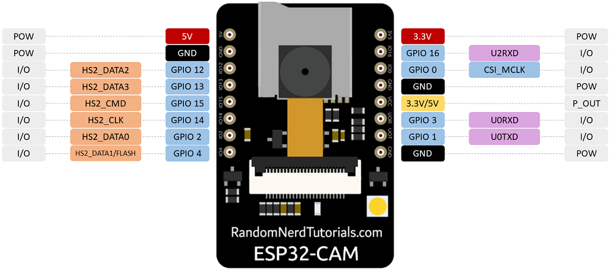

# CherryTracker

[](https://github.com/DouglasBgs/CherrryTracker.ninja/actions/workflows/main.yml) [](https://opensource.org/licenses/MIT)

##

## Sumário

1.  [**Introdução**](#1-introdução)
    1.  [**Objetivo deste documento**](#11-objetivo-deste-documento)
    2.  [**Escopo dos Hardwares do protótipo**](#12-escopo-dos-hardwares-do-protótipo)
        1.  [**CherryTracker e seus principais componentes**](#121-cherrytracker-e-seus-principais-componentes)
        2.  [**Missão da aplicação**](#122-missão-da-aplicação)
    3.  [**Escopo dos Software do protótipo**](#13-escopo-do-software-do-protótipo)
2.  [**Descrição geral do Protótipo**](#2-descrição-geral-do-protótipo)
3.  [**Requisitos do Sistema**](#3-requisitos-do-sistema)
    1.  [**Requisitos funcionais**](#31-requisitos-funcionais)
    2.  [**Requisitos não funcionais**](#32-requisitos-não-funcionais)
4.  [**Artefatos da Aplicação**](#4-artefatos-da-aplicação)
    1.  [**Diagrama de arquitetura**](#41-diagrama-de-arquitetura)
    2.  [**Diagrama de atividade**](#42-diagrama-de-atividade)
    3.  [**Casos de Uso**](#43-casos-de-uso)
        1. [**Descrição dos casos de uso**](#431-descrição-dos-casos-de-uso)
        2. [**Diagrama de casos de uso**](#432-diagrama-de-casos-de-uso)
5.  [**Considerações Finais**](#5-considerações-finais)
    1. [**Principais Dificuldades**](#51-principais-dificuldades)
    2. [**Aprendizados Obtidos**](#52-aprendizados-obtidos)
    3. [**RoadMap**](#53-roadmap)
    4. [**Evidências de funcionamento**](#54-evidências-de-funcionamento)

##

> ## 1 Introdução
>
> > #### 1.1 Objetivo deste documento
> >
> > > &nbsp;&nbsp;&nbsp;&nbsp;&nbsp;&nbsp; Neste documento são apresentado a especificação e evidências de implementação de um protótipo que é responsável por capturar dados de gps e imagens e armazená los, este protótipo foi nomeado de **CherryTracker**.
> > >
> > > &nbsp;&nbsp;&nbsp;&nbsp;&nbsp;&nbsp; Neste projeto temos o objetivo de aplicar os conceitos de FDD (Feature Driven Development) para o desenvolvimento do software, além de boas práticas de programação como o Clean Code.
> >
> > #### 1.2 Escopo dos Hardwares do protótipo
> >
> > > #### 1.2.1 CherryTracker e seus principais componentes
> > >
> > > > - &nbsp;&nbsp;&nbsp;&nbsp;&nbsp;&nbsp; **NEO-6M**: Responsável por captar e processar os dados de GPS, esse hardware consegue se conectar com sinal GPS, por meio de sua antena e é facilmente configurável, um dos seus principais pontos negativos é a potência de sua antena que não é capaz de atuar em ambientes fechados (sem exposição ao céu).
> > > >   &nbsp;&nbsp;&nbsp;&nbsp;&nbsp;&nbsp; &nbsp;&nbsp;&nbsp;&nbsp;&nbsp;&nbsp; &nbsp;&nbsp;&nbsp;&nbsp;&nbsp;&nbsp;
> > > >
> > > > - &nbsp;&nbsp;&nbsp;&nbsp;&nbsp;&nbsp; **ESP32**: Este dispositivo é responsável por processar os dados obtidos através do GPS e tratá-los. Este é um dispositivo com grande potencial, pois além de conter dois núcleos de processamento, possui também Bluetooth e WiFi integrados, isso possíbilita a criação de novas funcionalidades sem a necessidade da utilização de outros hardwares para conexão com os protocolos citados anteriormente.
> > > >   &nbsp;&nbsp;&nbsp;&nbsp;&nbsp;&nbsp; &nbsp;&nbsp;&nbsp;&nbsp;&nbsp;&nbsp; &nbsp;&nbsp;&nbsp;&nbsp;&nbsp;&nbsp;
> > > >
> > > > - &nbsp;&nbsp;&nbsp;&nbsp;&nbsp;&nbsp; **ESP32-CAM**: Este dispositivo é responsável por gravar e armazenar todos os dados obtidos, pois conta com uma câmera e uma entrada para cartão micro SD. Embora sua câmera tenha pouca qualidade de resolução é possível troca-lá por outro módulo com qualidade de imagem superior.
> > > >
> > > > &nbsp;&nbsp;&nbsp;&nbsp;&nbsp;&nbsp; &nbsp;&nbsp;&nbsp;&nbsp;&nbsp;&nbsp; &nbsp;&nbsp;&nbsp;&nbsp;&nbsp;&nbsp;
> > >
> > > #### 1.2.2 Missão da aplicação
> > >
> > > > &nbsp;&nbsp;&nbsp;&nbsp;&nbsp;&nbsp; Está aplicação tem o objetivo de facilitar o rastreamento de veículos, tendo em vista que existem muitas outras soluções que apenas gravam a localização do veículo em tempo real, esta é uma aplicação que além de localizar o veículo, também grava as imagens de todo o trajeto percorrido, facilitando a investigação de acidentes e outros problemas como desvio de rota e roubos, entre outros...
> > > >
> > > > &nbsp;&nbsp;&nbsp;&nbsp;&nbsp;&nbsp; Com estas imagens será possível saber exatamente o momento em que o veículo estava em determinada localização através de um mapa, que mostrará todo seu trajeto percorrido.
> > > >
> > > > &nbsp;&nbsp;&nbsp;&nbsp;&nbsp;&nbsp; A aplicação não deve ficar limitada a estas funcionalidades, novas atualizações podem trazer integração com a internet ou até mesmo Bluetooth, facilitando a integração com o sistema web.
> >
> > #### 1.3 Escopo do Software do protótipo
> >
> > > &nbsp;&nbsp;&nbsp;&nbsp;&nbsp;&nbsp; Utilizadas a linguagem **c++** para o desenvolvimento deste projeto, embora o hardware permita a utilização da linguagem **python** para o seu desenvolvimento, optamos por utilizar c++ devido a sua grande gama de bibliotecas disponíveis para hardwares. As principais bibliotecas utilizadas neste projeto estão listadas abaixo:
> > >
> > > - [ArduinoJson](https://arduinojson.org/)
> > >   - Responsável por padronizar a comunicação serial entre as duas placas (esp32 e esp32cam).
> > > - [TinyGPS++](http://arduiniana.org/libraries/tinygpsplus/)
> > >   - Responsável por realizar a leitura e transformação dos dados capturados pelo gps (NEO-6M) e facilitar a manipulação dos dados.
> > > - [ESP32CamLib](https://github.com/DouglasBgs/ESP32CamLib)
> > >
> > >   - Biblioteca criada **exclusivamente** para este projeto, com o objetivo de gerenciar a filmagem e armazenamento do arquivo no cartão SD. Esta biblioteca foi desenvolvida a partir da necessidade e dificuldade de gerar e gravar vídeos utilizando linguagens de baixo nível.
> > >
> > > &nbsp;&nbsp;&nbsp;&nbsp;&nbsp;&nbsp; Para garantir que o código esteja funcionando corretamente foram implementados um workflow que garante o total funcionamento do código, pois nele é feito o build da aplicação e também faz a analise do código (lint).
>
> ## 2 Descrição geral do Protótipo
>
> > &nbsp;&nbsp;&nbsp;&nbsp;&nbsp;&nbsp; O primeiro protótipo é um pequeno exemplo de funcionamento da aplicação, onde será feito a captura de dados do GPS e neste primeiro momento apenas a gravação de fotos no cartão SD, para que seja possível verificar se a integração entre todas as placas está ocorrendo como deveria.
> >
> > &nbsp;&nbsp;&nbsp;&nbsp;&nbsp;&nbsp; O segundo protótipo contará com a captura dos dados GPS como o primeiro protótipo porém contara com a gravação e armazenamento de vídeo.
>
> ## 3 Requisitos do Sistema
>
> > #### 3.1 Requisitos funcionais
> >
> > > - &nbsp;&nbsp;&nbsp;&nbsp;&nbsp;&nbsp; RF_001 O usuário não deve conseguir mexer no sistema.
> > > - &nbsp;&nbsp;&nbsp;&nbsp;&nbsp;&nbsp; RF_002 O GPS deve estar sempre capturando e enviando dados para o controlador(ESP32).
> > > - &nbsp;&nbsp;&nbsp;&nbsp;&nbsp;&nbsp; RF_003 O Sistema deve ser capaz de ligar automaticamente.
> > > - &nbsp;&nbsp;&nbsp;&nbsp;&nbsp;&nbsp; RF_004 O sistema deve gravar os dados no cartão sd.
> > > - &nbsp;&nbsp;&nbsp;&nbsp;&nbsp;&nbsp; RF_005 O sistema deve ascender um led sempre que o estiver gravando.
> > > - &nbsp;&nbsp;&nbsp;&nbsp;&nbsp;&nbsp; RF_006 O sistema deverá gravar o nome do arquivo com números aleatórios.
> >
> > #### 3.2 Requisitos não funcionais
> >
> > > - &nbsp;&nbsp;&nbsp;&nbsp;&nbsp;&nbsp; RNF_001 O sistema não terá conexão coma a internet nem Bluetooth.
> > > - &nbsp;&nbsp;&nbsp;&nbsp;&nbsp;&nbsp; RNF_002 O GPS deve se conectar ao ESP32.
> > > - &nbsp;&nbsp;&nbsp;&nbsp;&nbsp;&nbsp; RNF_003 O Sistema deve permanecer ligado em StandBy.
> > > - &nbsp;&nbsp;&nbsp;&nbsp;&nbsp;&nbsp; RNF_004 O sistema deve armazenar os dados.
> > > - &nbsp;&nbsp;&nbsp;&nbsp;&nbsp;&nbsp; RNF_005 O GPS deve sempre ficar ligado.
> > > - &nbsp;&nbsp;&nbsp;&nbsp;&nbsp;&nbsp; RNF_006 A câmera deve funcionar apenas com o veículo ligado.
> > > - &nbsp;&nbsp;&nbsp;&nbsp;&nbsp;&nbsp; RNF_007 Plataforma de desenvolvimento: Arduino IDE.
> > > - &nbsp;&nbsp;&nbsp;&nbsp;&nbsp;&nbsp; RNF_008 Linguagem de desenvolvimento C++.
>
> ## 4 Artefatos da Aplicação
>
> > #### 4.1 Diagrama de arquitetura
> >
> > > - Neste diagrama é possível observar a conexão entre os dispositivos, onde a bateria representada na imagem abaixo deve ser a ligação com o sistema de bateria do veículo.
> > >   &nbsp;&nbsp;&nbsp;&nbsp;&nbsp;&nbsp; &nbsp;&nbsp;&nbsp;&nbsp;&nbsp;&nbsp; &nbsp;&nbsp;&nbsp;&nbsp;&nbsp;&nbsp;
> >
> > #### 4.2 Diagrama de atividade
> >
> > > - Neste diagrama é possível observarmos o fluxo de atividades que será realizada por cada hardware presente no sistema e como cada uma das atividades dependem uma da outra para o correto funcionamento do sistema.
> > >   &nbsp;&nbsp;&nbsp;&nbsp;&nbsp;&nbsp; &nbsp;&nbsp;&nbsp;&nbsp;&nbsp;&nbsp; &nbsp;&nbsp;&nbsp;&nbsp;&nbsp;&nbsp;
> >
> > #### 4.3 Casos de Uso
> >
> > > ##### 4.3.1 Descrição dos casos de uso
> > >
> > > > **Caso de uso 1:**
> > > > Nome: Ligar o veículo
> > > > Atores: Usuário
> > > > Prioridade: 3 essencial
> > > > Pré-condições: Ter bateria no veículo.
> > > > Fluxo do evento principal: O ator irá ligar o veículo dando início a gravação dos dados
> > > > Fluxo alternativo: Caso não seja obtidos dados do gps o programa não funcionará corretamente.
> > > >
> > > > **Caso de uso 2:**
> > > > Nome: Extrair Dados
> > > > Atores: Usuário
> > > > Prioridade: 3 essencial
> > > > Pré-condições: possuir dados no cartão SD.
> > > > Fluxo do evento principal: O ator irá remover o cartão SD do dispositivo para posteriormente visualizar as informações contidas nele.
> > >
> > > ##### 4.3.2 Diagrama de casos de uso.
> > >
> > > &nbsp;&nbsp;&nbsp;&nbsp;&nbsp;&nbsp; &nbsp;&nbsp;&nbsp;&nbsp;&nbsp;&nbsp; &nbsp;&nbsp;&nbsp;&nbsp;&nbsp;&nbsp;
>
> ## 5 Considerações Finais
>
> > #### 5.1 Principais Dificuldades
> >
> > > &nbsp;&nbsp;&nbsp;&nbsp;&nbsp;&nbsp; As principais dificuldades para desenvolver esse projeto foram o estudo e entendimento do funcionamento do hardware e a comunicação serial utilizando o protocolo UART. Outra grande dificuldade encontrada ao decorrer do projeto foi na geração de vídeo devido a limitação do hardware e também a não existência de bibliotecas para a gravação e manipulação de vídeo, demandando assim muito tempo para procurar referencias em outros projetos que utilizam a gravação de vídeo.
> > >
> > > &nbsp;&nbsp;&nbsp;&nbsp;&nbsp;&nbsp; Estas dificuldades citadas anteriormente também compartilham da dificuldade de aprender uma nova linguagem de programação de baixo nível, pois existem muitas diferenças se comparada a uma linguagem de alto nível(javascript), por ser uma linguagem orientada a objetos e ter o controle de memória, a utilização de polimorfismo e encapsulamento de dados, entre outros.
> >
> > #### 5.2 Aprendizados Obtidos
> >
> > > &nbsp;&nbsp;&nbsp;&nbsp;&nbsp;&nbsp; Embora este projeto tenha sido muito desafiador em vários aspectos, muitos destes desafios foram concluídos através dos aprendizados obtidos durante o desenvolvimento deste projeto, com isso destaca-se os principais aprendizados obtidos, como a utilização do _github actions_, que é uma ferramenta muito poderosa para a geração e controle de workflows, possibilitando a implementação de CI/CD entre outras atividades.
>>>
> > > &nbsp;&nbsp;&nbsp;&nbsp;&nbsp;&nbsp; O manuseio e instalação de microcontroladores utilizados no decorrer do processo de desenvolvimento, tanto no que diz respeito a ligações entre hardwares quanto a comunicação entre os softwares desenvolvidos ou utilizados pelo sistema.
> >
> > #### 5.3 RoadMap
> >
> > > - Criar a integração do sistema utilizando WiFi.
> > > - Modularizar o sistema criando determinadas funcionalidades extras como, como a armazenagem de dados na nuvem.
> > > - Acompanhamento dos dados em tempo real.
> > > - limitação dos últimos videos disponíveis para visualizar de acordo com a licença obtida.
>>
> > #### 5.4 Evidências de funcionamento
>>> &nbsp;&nbsp;&nbsp;&nbsp;&nbsp;&nbsp; É possível verificar alguns exemplos de funcionamento na pasta [exemples](exemples).
>>> - Json gerado pelo protótipo:
>>>```json
>>>[{"latitude":-26.34915543,"longitude":-48.80789185,"altitude":0.0132,"velocidade":6.96352005,"numeroSatelites":0,"data":"1-12-2022","hora":"19:4:21"},
>>>{"latitude":-26.34915543,"longitude":-48.80789185,"altitude":0.0132,"velocidade":6.96352005,"numeroSatelites":0,"data":"1-12-2022","hora":"19:4:21"},
>>>{"latitude":-26.34915543,"longitude":-48.80789185,"altitude":0.0132,"velocidade":6.96352005,"numeroSatelites":0,"data":"1-12-2022","hora":"19:4:21"},
>>>{"latitude":-26.34915543,"longitude":-48.80789185,"altitude":0.0132,"velocidade":6.96352005,"numeroSatelites":0,"data":"1-12-2022","hora":"19:4:23"},
>>>{"latitude":-26.34922791,"longitude":-48.80823135,"altitude":0.024,"velocidade":14.66784,"numeroSatelites":9,"data":"1-12-2022","hora":"19:4:25"},
>>>{"latitude":-26.34914398,"longitude":-48.80832291,"altitude":0.0149,"velocidade":18.48295975,"numeroSatelites":9,"data":"1-12-2022","hora":"19:4:27"},
>>>{"latitude":-26.34910965,"longitude":-48.80835342,"altitude":0.0149,"velocidade":18.72372055,"numeroSatelites":0,"data":"1-12-2022","hora":"19:4:30"},
>>>{"latitude":-26.34910965,"longitude":-48.80835342,"altitude":0.0149,"velocidade":18.72372055,"numeroSatelites":0,"data":"1-12-2022","hora":"19:4:33"},
>>>{"latitude":-26.34910965,"longitude":-48.80835342,"altitude":0.0149,"velocidade":18.72372055,"numeroSatelites":0,"data":"1-12-2022","hora":"19:4:35"},
>>>{"latitude":-26.34910965,"longitude":-48.80835342,"altitude":0.0149,"velocidade":18.72372055,"numeroSatelites":0,"data":"1-12-2022","hora":"19:4:37"},
>>>{}]
>>>```
>>> - Video gerado pelo protótipo:
    [clique para visualizar](exemples/cherrytracker1481771691.avi)
>>>


